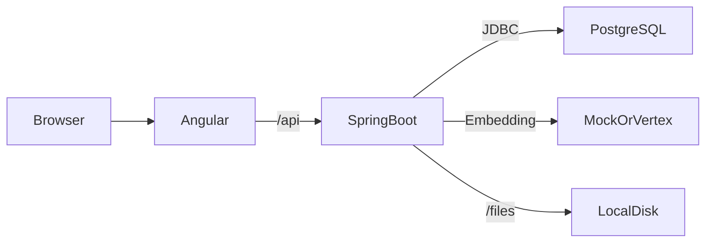

# AI-Enhanced E-commerce Platform

Full-stack e-commerce monorepo with image-similarity recommendations and AI-drafted product descriptions.

- **Backend:** Spring Boot 3.3.4 / Java 21 / PostgreSQL 16 / Flyway / JWT
- **Frontend:** Angular 17 (standalone, signals, Tailwind) — _added in a later PR_
- **AI:** Mock provider by default, swap to Vertex AI (`multimodalembedding@001` + `gemini-1.5-flash`) via `AI_PROVIDER=vertex`

## Prerequisites

| Tool       | Version | Verify                |
| ---------- | ------- | --------------------- |
| Java       | 21      | `java -version`       |
| Maven      | 3.9+    | `mvn -version`        |
| Node       | 20.x    | `node -v`             |
| npm        | 10.x    | `npm -v`              |
| PostgreSQL | 16      | `psql --version`      |

### Install PostgreSQL

| OS              | Command                                                                |
| --------------- | ---------------------------------------------------------------------- |
| Ubuntu / Debian | `sudo apt install postgresql-16 && sudo systemctl start postgresql`    |
| macOS (brew)    | `brew install postgresql@16 && brew services start postgresql@16`      |
| Windows         | EnterpriseDB installer, default port 5432, set superuser password.     |

## Local setup

```bash
# 1. Database
sudo -u postgres psql -f backend/scripts/setup-db.sql

# 2. Configure (defaults are fine for local dev)
cp .env.example .env

# 3. Backend
cd backend
mvn spring-boot:run         # http://localhost:8080
```

The app uses Flyway and starts with `spring.jpa.hibernate.ddl-auto=validate`. Three migrations apply automatically on first start:

- `V1__init.sql` — schema (users, category, product, cart, cart_item, orders, order_item)
- `V2__seed.java` — categories, demo users (with freshly-computed BCrypt hashes), 12 sample products
- `V3__indexes.sql` — indexes

## Default credentials

| Role    | Email             | Password      |
| ------- | ----------------- | ------------- |
| Admin   | admin@demo.com    | `Admin123!`   |
| Shopper | shopper@demo.com  | `Shopper123!` |

## Configuration

All config keys live in `backend/src/main/resources/application.yml` and are overridable via env vars (see `.env.example`):

| Env var                          | Default                                          | Notes                                       |
| -------------------------------- | ------------------------------------------------ | ------------------------------------------- |
| `DB_URL`                         | `jdbc:postgresql://localhost:5432/ecommerce`     |                                             |
| `DB_USER` / `DB_PASSWORD`        | `ecommerce` / `ecommerce`                        |                                             |
| `JWT_SECRET`                     | _placeholder_                                    | **Must be ≥ 32 UTF-8 bytes** or app fails fast |
| `UPLOADS_DIR`                    | `./uploads`                                      | Stored files for product images             |
| `CORS_ORIGINS`                   | `http://localhost:4200`                          | Comma-separated allowlist                   |
| `AI_PROVIDER`                    | `mock`                                           | `mock` or `vertex`                          |
| `GOOGLE_APPLICATION_CREDENTIALS` | _empty_                                          | Path to GCP service-account JSON            |

## Switching to real Vertex AI

1. Create a service account and download a JSON key.
2. Export `GOOGLE_APPLICATION_CREDENTIALS=/abs/path/to/key.json` and `GOOGLE_CLOUD_PROJECT=<your-project>`.
3. Set `AI_PROVIDER=vertex`.
4. Restart the backend. The deterministic mock embeddings are replaced with `multimodalembedding@001` (1408-dim) and Gemini Flash for descriptions.

> The mock embedder produces a deterministic vector from the **bytes of the input image**, NOT from any visual semantic. Two visually-similar products won't have similar mock vectors. The "Visually Similar" carousel on `mock` is therefore approximately random — it exists to verify the math pipeline works. Switch to `vertex` for true visual similarity.

## API

OpenAPI / Swagger UI: http://localhost:8080/swagger-ui.html

Quick auth examples:

```bash
# Register a shopper
curl -X POST http://localhost:8080/api/auth/register \
  -H 'Content-Type: application/json' \
  -d '{"email":"alice@example.com","password":"alice1234"}'

# Login
curl -X POST http://localhost:8080/api/auth/login \
  -H 'Content-Type: application/json' \
  -d '{"email":"admin@demo.com","password":"Admin123!"}'

# Categories (public)
curl http://localhost:8080/api/categories
```

## Architecture



## Project structure

```
ai-ecommerce/
├── backend/                           # Spring Boot 3.3.4 / Java 21
│   ├── pom.xml
│   ├── scripts/setup-db.sql
│   └── src/{main,test}/...
├── frontend/                          # Angular 17 (added later)
└── .github/workflows/ci.yml
```

## Testing

```bash
cd backend
mvn -B clean verify         # unit + integration tests
```

## Troubleshooting

| Symptom                                                  | Fix                                                                       |
| -------------------------------------------------------- | ------------------------------------------------------------------------- |
| `connection refused` on startup                          | PostgreSQL not running. `sudo systemctl start postgresql`.                |
| `relation "product" does not exist`                      | App started without Flyway. Make sure `spring.flyway.enabled=true`.       |
| `JWT secret must be at least 32 bytes`                   | Set `JWT_SECRET` to a string ≥ 32 UTF-8 bytes (e.g. a 40-char passphrase). |
| `Could not change directory to "/home/ubuntu"` from psql | Harmless. Run `sudo -u postgres psql` from `/tmp` to silence it.          |

## License

Educational / graduation project. No license header required for source files.
